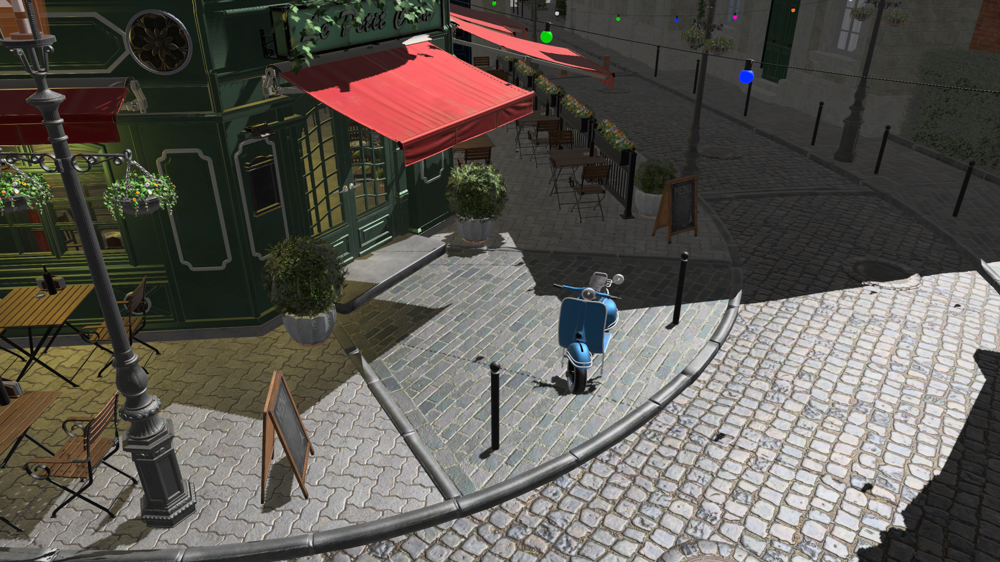
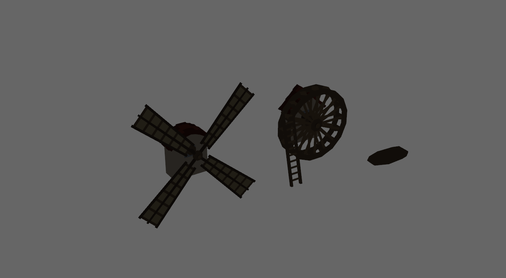
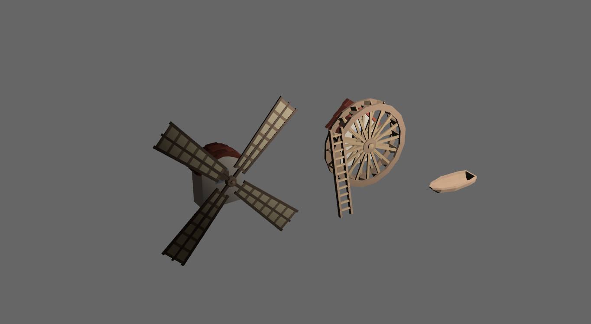

+++
title = "Bevy - a FOS game engine"
draft = false
weight = 2
description = """My first time working with a game engine and contributing
to a Free and Open Source project"""
+++

[Bevy](https://bevyengine.org/) is a free and open source data-driven game
engine written in Rust.

 

It is built around Bevy ECS - an implementation of the Entity Component
System, a relatively new approach to game object representation. An entity is
just a number, an identifier for the object; there can then be many components
with their own data associated with that number. These would be the fields
of a traditional, OOP-style game object. Finally, the behavior of entities
with certain components is determined by systems - functions that run each
frame and modify these components.

# Motivation

I wanted to learn Rust and get myself familiar with OSS development processes.
Besides Bevy, I had many other smaller, niche projects in mind that I could
contribute to, but Bevy really stood out as a perfect candidate to learn
from during this course, the major reason for that being the community around
this project.

# Work done

I did contribute code to the project: some of it didn't get merged, but some
did. One contribution of my was pinning down the reason lighting wouldn't
work properly when importing a camera from external format called glTF.

You can the the bug and proper behavior below:

 

Since it was more of a learning experience for me than anything else,
most of my time spent with Bevy was looking at the codebase and reading
documentation. I also actively participated in testing, code reviews, and
technical discussions. Right now, I am working on a game prototype to be
able to learn even more.

# Outcomes

Working with this relatively big project resulted in an improvement of
my professional skills, expansion of knowledge in the field of graphics,
animation, and systems programming, in general.

It also presented me with a few insights into effective project management,
whi ch is of greater importance to me. I have abandoned a number of personal
projects due to loss of interest after hours of overtime work. Losing focus,
or not having one in the first place, was another issue. Working on Bevy on
a regular basis, with specific goals in mind has taught me a lot.

 
